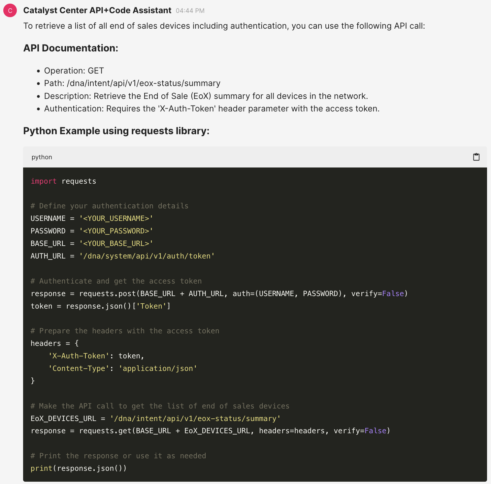
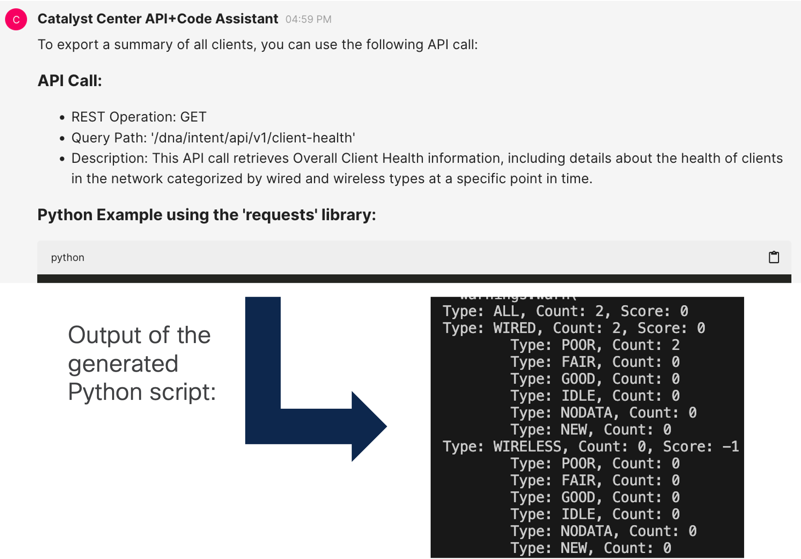
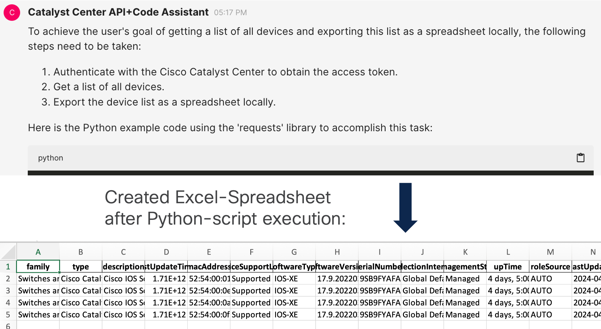
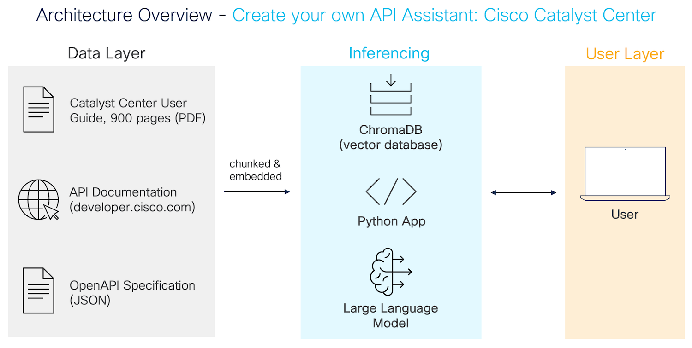
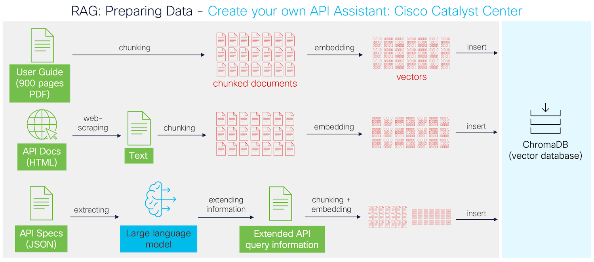
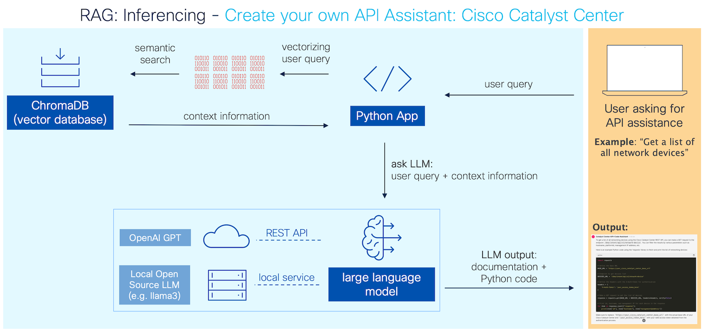

# Understanding RAG: Create your own API Assistant

**Generate Python code around the REST API of Cisco Catalyst Center** (formerly Cisco DNA Center). You can blueprint this project for any other REST API.

**Features**:

* **Learn & understand RAG**: Nicely structured & well documented code
* Python libraries are **kept to a minimum** (no LangChain, no Llamaindex)
* **OpenAI APIs and Open Source LLMs** are supported.
* Use it to **save time when creating new code** for Catalyst Center APIs
* Fully functioning **full-stack application** with front- & back-end

## Output Examples

### Example 1: "get me a list of all end of sales devices. include authentication"



### Example 2: "export a summary of all clients"



### Example 3: "get me a list of all devices and export this list as a spreadsheet locally. include the authentication function"



### Other examples

* export all templates
* run the cli command "show version" directly on every device
* get the latest running configuration of one device
* how to claim a device to a site

## Getting Started

### 1. Download & Install

Clone the code & install all required libraries (recommended with [Poetry](https://pypi.org/project/poetry/)):

At first install poetry on your computer:

```
pip install poetry
```

Then, create all dependencies within a virtual environment (using poetry):

```
git clone https://github.com/flopach/create-your-own-api-assistant-cisco-catalyst-center &&
cd create-your-own-api-assistant-cisco-catalyst-center &&
poetry install &&
poetry shell
```

### 2. Decide which LLM to use

Decide which LLM to use: OpenAI or Open-Source LLM with Ollama

* **OpenAI**: If not already done for, insert your OpenAI API key as stated in the [OpenAI documentation](https://platform.openai.com/docs/quickstart/step-2-set-up-your-api-key).
* **Open Source LLM**: In order to run your LLM locally, install [Ollama](https://ollama.com/) and download the LLM of your choice (e.g. llama3).

Open **main.py** and change the parameters if needed. Default settings are: OpenAI with the model "gpt-3.5-turbo".

### 3. Run & import data

Run the server and start chatting at [http://localhost:8000/](http://localhost:8000/):

```
chainlit run main.py
```

You should see a chat window. **If it is your first run**, type `importdata` to load, chunk and embed all data in the vector database.

## Architecture & Components

The app follows the RAG architecture (Retrieval Augmented Generation). This is an efficient approach where relevant context data will be added to the LLM-query of the user.



Components overview:

* **Data Layer**: data to be stored in the vector database
	* Catalyst Center User Guide, 900 pages PDF document
	* Catalyst Center API documentation, scraped from [developer.cisco.com/docs/dna-center/](https://developer.cisco.com/docs/dna-center/)
	* Catalyst Center OpenAPI Specification. This documentation will be extended with newly created data by the LLM.
* **Application Components**: 
	* [Vector Database ChromaDB](https://www.trychroma.com/): an easy-to-use vector database with a well-documented Python SDK
	* LLM: OpenAI GPT APIs or local Open Source LLM (e.g. llama3) with Ollama
	* web UI for the browser conversation: [Chainlit Python library](https://chainlit.io)
* **Python Code Structure**:
	* **main.py** - Starting point of the app. This is where all class instances are created and the webUI via chainlit is defined.
	* **ImportData.py** - The listed data above is being imported in the class _DataHandler_.
	* **TalkToDatabase.py** - The database interaction (querying, embedding data) is done through the class _vectorDB_
	* **TalkToOpenAI.py** - Used for the interactions with OpenAI's GPT via their REST APIs.
	* **TalkToOllama.py** - Used for the interactions with Ollama.

## RAG: Preparing data (ImportData.py)

In a RAG architecture, you embed your own (local) data into a vector database. When the user is asking the LLM to generate data (= LLM-inferencing), some context data is also sent together with the user-query to the LLM to generate output.



3 different examples of how to import and pre-process the data:

* **Import PDF document (user guide)**: Only the text of the 900 pages user guide of the Catalyst Center will be exported and based on a fixed number of characters splitted. Then, the chunks will be converted to vectors with a pre-defined embedding function and inserted into the vector database.
* **Scraping websites (API documenation)**: Since the API documentation is located at [developer.cisco.com/docs/dna-center/](https://developer.cisco.com/docs/dna-center/), the documentation will be requested and text data will be scraped from the HTML documents. Then the text will be chunked, embedded and inserted.
* **Generating new content based on existing data (API Specification)**: Since the API specification contains all the REST API calls, it is very important to prepare this document thoughtfully. Therefore, only the non-redundant information are getting extracted and the API query descriptions are extended with the LLM based on existing knowledge stored in the vector database. Use-cases are also included.

> **Note**: Generating new data with the API specification can be time intense and is therefore optional per default. It takes approximately 1 hour with OpenAI APIs (GPT-3.5-turbo) and around 10 hours with llama3-8B on a Macbook Pro M1 (16GB RAM).
> 
> That's why I have already included the generated data in a JSON file `extended_apispecs_documentation.json` located in the `/data` folder. This data is generated with GPT-3.5-turbo.

## RAG: Inferencing

Once the data is imported, the user can query the LLM.



1. User is writing the task into the chat
2. The task (string) is vectorized and queried against the vector database. The vector database returns a specific number of documents which are semantically similar to the task.
3. The task string and the context information is put into the prompt of the LLM.
4. Finally, the LLM is giving the output based on the provided  data input.

## Next steps & FAQs

**Q: Is this app ready for production? Is providing 100% accurate results?**

No. This project can be useful especially when developing new applications with the Catalyst Center REST API, but the output might not be 100% correct.

**Q: How can the LLM generate better results?**

Try out other chunking methods, add other relevant data, extend the system prompt, include the response schemas from the openAPI specifications, etc. There are many ways you can tweak this app even more to generate better results!

**Q: Should I use OpenAI or Ollama? What is your experience?**

Try them both! You will see different performances for each LLM. I got better results with GPT-3.5.turbo compared to llama3-8B.

**Q: How can I test the Python code if I don't have access to a Cisco Catalyst Center?**

You can use a DevNet sandbox for free. Use the [Catalyst Center always-on sandbox](https://devnetsandbox.cisco.com/DevNet/catalog/Catalyst-Center-Always-On): Copy the URL + credentials into your script.

**Q: How can I change the bot name and auto-collapse messages?**

Some chainlit settings need to be set in the configuration file which can not be changed during runtime. Therefore, only the [default parameters are used](https://docs.chainlit.io/backend/config/ui).

You can change these settings in **.chainlit/config.toml**:

```
[UI]
# Name of the app and chatbot.
name = "Catalyst Center API+Code Assistant"

# Large size content are by default collapsed for a cleaner ui
default_collapse_content = false
```

## Versioning

**1.0** - initial version. RAG with Catalyst Center 2.3.7

## Authors

* **Flo Pachinger** - *Initial work* - [flopach](https://github.com/flopach)

## License

This project is licensed under the Cisco Sample Code License 1.1 - see the [LICENSE.md](LICENSE.md) file for details.

The Cisco Catalyst User Guide (PDF document) located in the "data" folder is copyright by Cisco.

## Further Links

* [Cisco DevNet Website](https://developer.cisco.com)